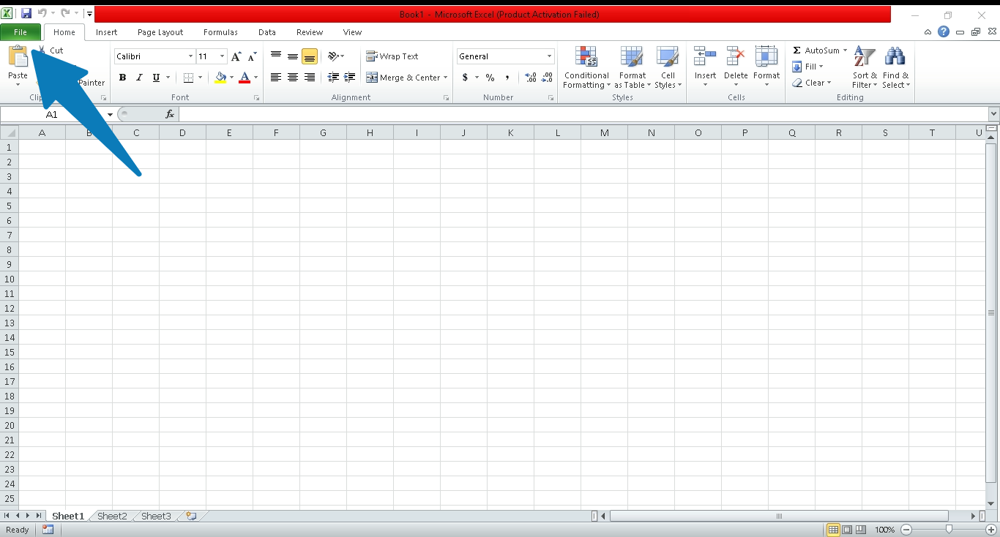
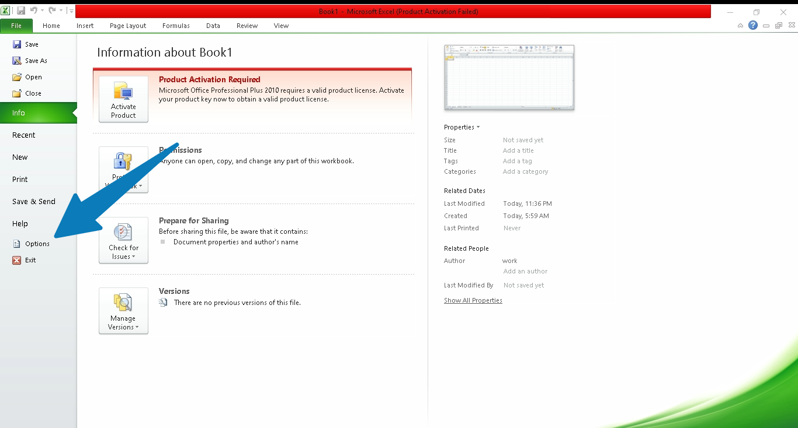
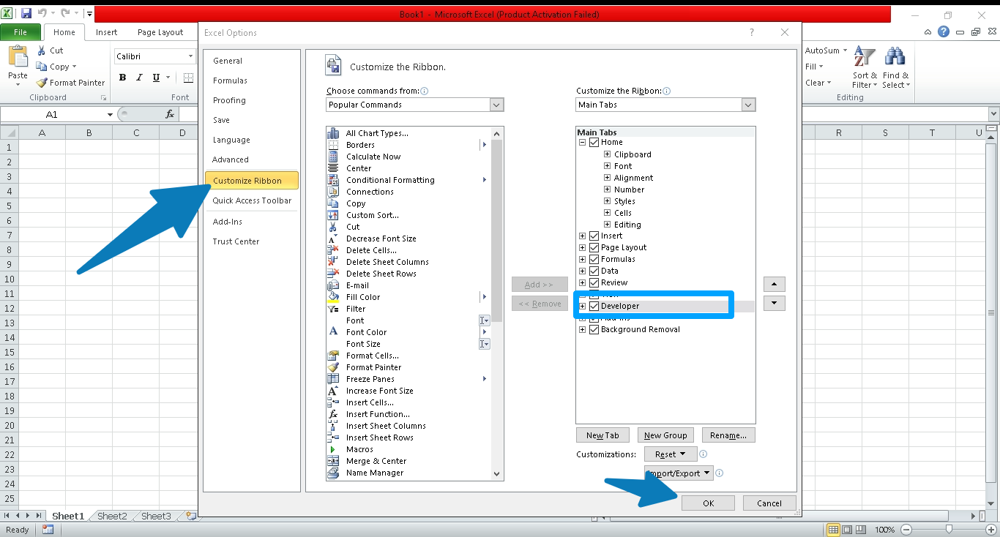
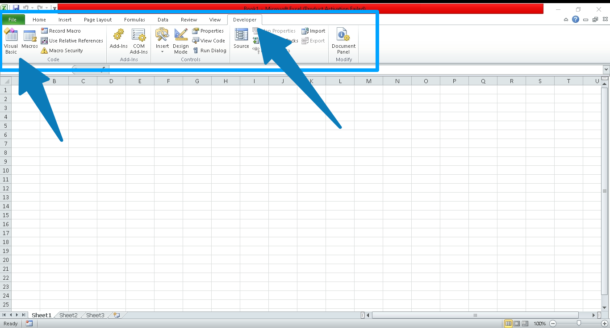
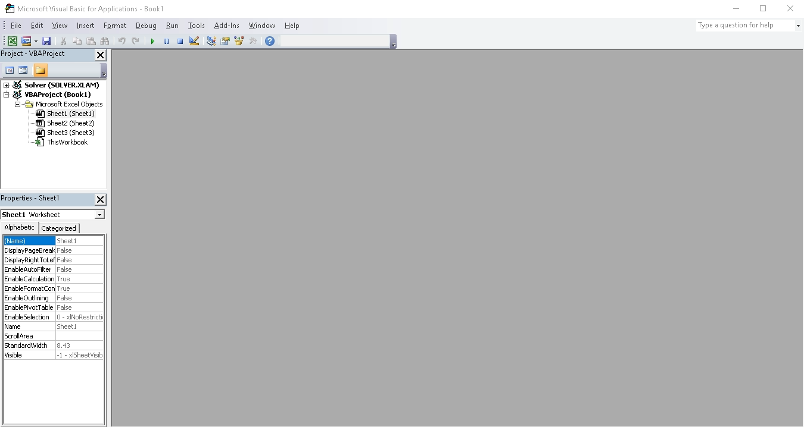
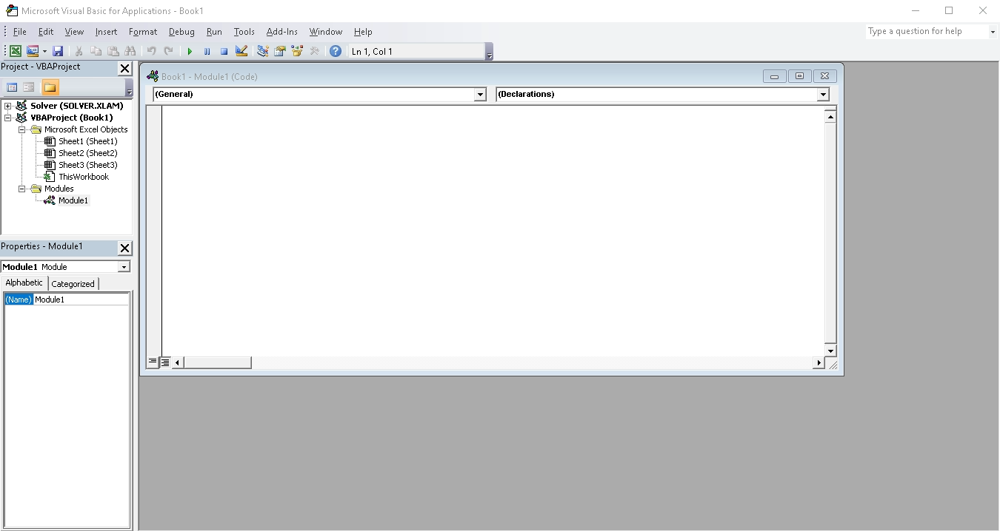
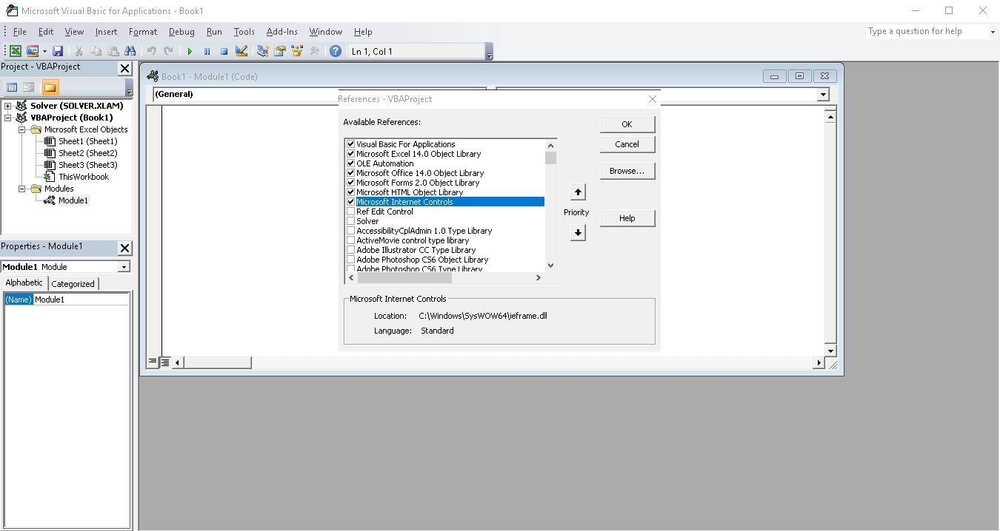
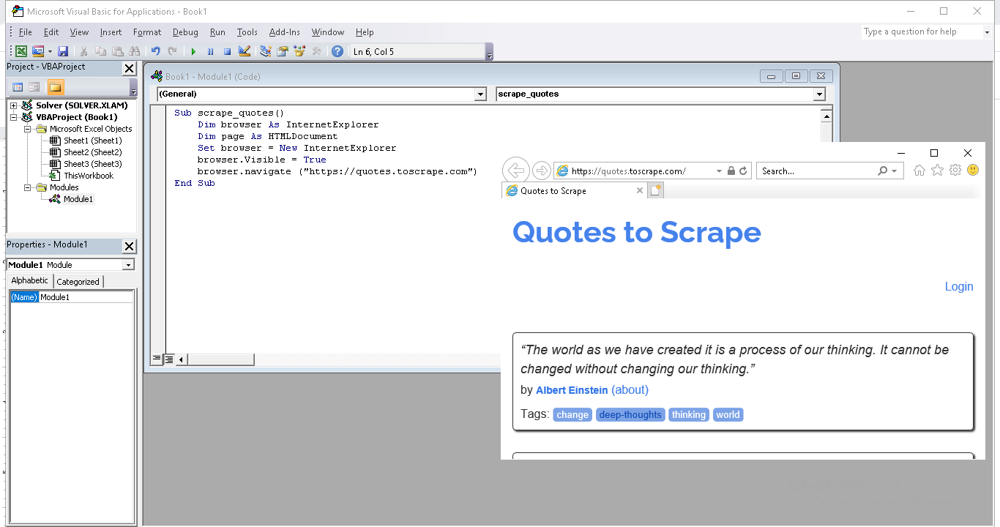
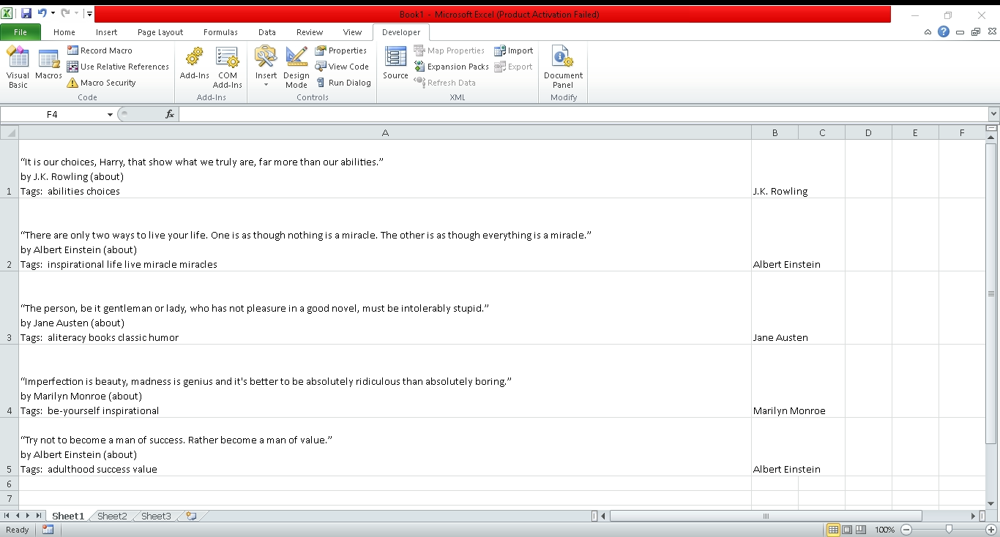

# Web Scraping With Excel VBA

In this tutorial, we are going to learn how to implement a web scraper in Excel using VBA. We will briefly go through the installation and prepare the environment. We will also write a scraper using VBA macro to fetch data into excel. So, let’s get started.

## What is Web Scraping?

Web scraping is a technique to extract useful data from the Internet. Modern Internet heavily relies on web scraping. Every time you use a search engine such as Google or Duck Duck Go, etc. you are seeing the results of mass web scraping. For example, Google scrapes billions of pages every day to refine and index the latest relevant information.

## What is VBA?

VBA stands for “Visual Basic Application”. It is a programming language of Microsoft Corporation. VBA extends the capabilities of Microsoft office tools and allows users to develop advanced functions and complex automation. VBA can also be used to write macros to pull data from websites into Excel.

## Pros and Cons of Using VBA for Scraping

Let’s discuss some of the advantages and disadvantages of VBA web scraping:

### Pros

- **ready to use** - VBA is bundled with Microsoft Office, if you already have Microsoft office installed then you won’t have to install anything. You can use VBA right away in all the Microsoft office tools.
- **reliable** - Both Microsoft Excel & VBA are developed and maintained by Microsoft. Unlike other development environments, these tools can be upgraded together to the latest version without much hassle.
- **Out-of-the-box support for browser** - VBA web scrapers can take advantage of Microsoft’s built-in browser Internet Explorer or the latest Microsoft Edge which makes javascript-based dynamic website scraping pretty convenient.  
- **Complete automation** - When running the VBA script, the user doesn’t have to click any buttons or, interact with the browser. All of these can be done from the VBA script including log-in, scrolling, button clicks, etc.

### Cons

- **Only works in Windows** - VBA scrapers are not cross-platform. It only works in a Windows environment. Note that, Microsoft office has support for Mac but it is way harder to write a working VBA scraper on Mac. The library supports are also limited, for example, you can not use Internet Explorer or Microsoft Edge.
- **Tightly Coupled with Microsoft Office** - VBA scrapers are tightly coupled with Microsoft Office tools. Third-party useful scraping/helper tools are hard to integrate with it.
- **Steep learning Curve** - VBA programming language is less beginner friendly and a  bit harder than the other modern programming languages such as Python or Javascript.  

Overall, if you are looking to develop a web scraper for the windows operating system that automatically pulls data from a website into Excel and, won’t need support for other operating systems, then VBA-based web scraping will be a good choice.  

Now, that we learned about VBA Web scraping. Let’s explore VBA scripting and write our first web scraper.

## Guide to Extracting Website Data by Using Excel VBA

Before we begin, let us make sure we’ve installed all the prerequisites and set up our environment properly so that it will be easier to follow along.

### Prerequisites

In this tutorial, I will be using Windows 10 & Microsoft Office 10. However, the steps will be same or similar for other version of windows.
You will only need a computer with Windows Operating System.  In addition, you will also have to install Microsoft Office if you don’t have it already. Detailed installation instructions can be found in the  Microsoft’s Official documentation

### Preparing the environment

Now, that you’ve installed Microsoft office, complete the below steps to setup the development environment:

### Step 1 - Open Microsoft Excel

From the start menu or Cortana search, find Microsoft Excel and open the application. You will see a similar interface as below:

Click on File



### Step 2 - Go to Option to enable developer menu

By default, Excel doesn’t show the developer button in the top ribbon. To enable this we will have to go to “Options” from the File menu.



### Step 3 -  Select Customize Ribbon

Once you click the “Options”, a dialog will pop up, from the side menu select “Customize Ribbon”. Click on the check box next to “developer”. Make sure it is ticked and then click on Ok.



### Step 4 - Open Visual Basic Application Dialog

Now you will see a new developer button on the top ribbon, clicking on it will expand the developer menu. From the menu, select “Visual Basic”



### Step 5 - Insert a new Module

Once you click on visual basic, it will open a new window like below:



Click on “insert” and select “Module” to insert a new module. It will open the module editor



### Step 6 - Add new references


From the top menu select `Tools >  References...`, it will open a new window like the one below. Make sure to scroll through the available list of references and find Microsoft HTML Client Library & Microsoft Internet Controls in the check box. Click on the check box next to both of them to enable these references.  Once you are done click ok.



That’s it! Our development environment is all set. Let’s write our first Excel VBA scraper

### Step 7 - Automate Microsoft Edge to Open a website

In this step, we will update our newly created module to open the following website: <https://quotes.toscrape.com>. In the module editor let’s write the below code:

```vb
Sub scrape_quotes()
    Dim browser As InternetExplorer
    Dim page As HTMLDocument
    Set browser = New InternetExplorer
    browser.Visible = True
    browser.navigate ("https://quotes.toscrape.com")
End Sub
```

We are defining a subroutine named `scrape_quotes()`. This function will be executed when we run this script. Inside the subroutine, we are defining two objects `browser` and  `page`.

The `browser` object will allow us to interact with Microsoft Edge. Then we also set the browser as visible so that we can see it in action. The browser.`navigate()` function tells the VBA browser object to open the URL.  The output will be similar to this:



>💡 Note: You might be wondering why we are writing `InternetExplorer` to interact with Microsoft Edge. VBA initially only supported Internet Explorer-based automation, but once Microsoft discontinued Internet Explorer. They deployed some updates so that VBA’s InternetExplorer module can run the Microsoft Edge browser in IEMode without any issues. The above code will also work in older Windows that have Internet Explorer still available instead of Edge.

### Step 8 - Scrape Data using VBA Script & Save it to Excel

Now, we will scrape the quotes and authors from the website. For simplicity, we will store it in the first Sheet of the excel spreadsheet and, grab the top 5 quotes for now.

We will begin by defining two new objects one for quotes & other for authors

```vb
    Dim quotes As Object
    Dim authors As Object
```

After navigating to the website we will also add a little bit of pause so that the website loads properly by using Loop.

```vb
Do While browser.Busy: Loop
```

Next we will grab the quotes and authors from the HTML document:

```vb
    Set page = browser.document
    Set quotes = page.getElementsByClassName("quote")
    Set authors = page.getElementsByClassName("author")
```

Then, we will use a for loop to populate the excel rows with the extracted data by calling the Cells function and passing the row and column position:

```vb
    For num = 1 To 5
        Cells(num, 1).Value = quotes.Item(num).innerText
        Cells(num, 2).Value = authors.Item(num).innerText
    Next num
```

Finally, we will close the browser by calling the quit function. This will close the browser Window.

```vb
    browser.Quit
```

## Output

Now if we run the script again, it will open Microsoft Edge and browse to the quotes.toscrape.com website, grab the top 5 quotes from the list and save them to the current excel file’s first sheet.



## Source Code

The full source code is given below:

```vb
Sub scrape_quotes()
    Dim browser As InternetExplorer
    Dim page As HTMLDocument
    Dim quotes As Object
    Dim authors As Object
    
    Set browser = New InternetExplorer
    browser.Visible = True
    browser.navigate ("https://quotes.toscrape.com")
    Do While browser.Busy: Loop
    
    Set page = browser.document
    Set quotes = page.getElementsByClassName("quote")
    Set authors = page.getElementsByClassName("author")
    
    For num = 1 To 5
        Cells(num, 1).Value = quotes.Item(num).innerText
        Cells(num, 2).Value = authors.Item(num).innerText
    Next num
    
    browser.Quit
End Sub
```

## Conclusion

Let’s do a quick recap before calling it a day. VBA-based web scraping is a great choice for Windows automation and web extraction. It enables us to automate and extract web data.  We learned the pros and cons of Excel VBA.  We also learned all the steps of how to prepare the development environment & use VBA script with Excel to automate Microsoft Edge and scrape data from the Internet.  

The biggest disadvantage that we’ve seen is the lack of cross-platform support. If you want to develop web scrapers that can be used on multiple operating systems such as Linux or mac, etc. then Web Query can also be an option. But, I would recommend exploring Python. It is arguably the best programming language for extracting web data and it can save data in excel format in a few lines of code!
