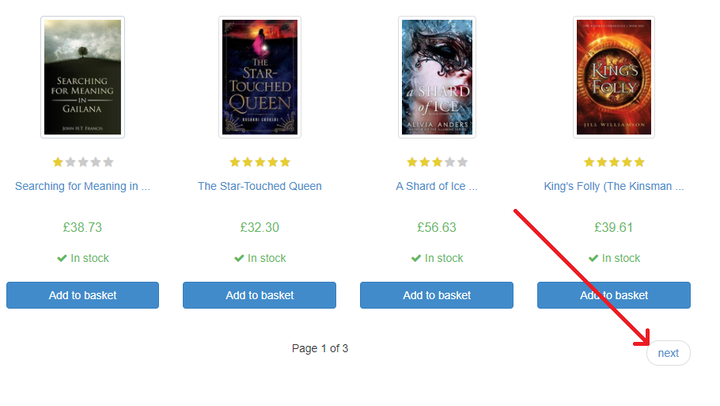
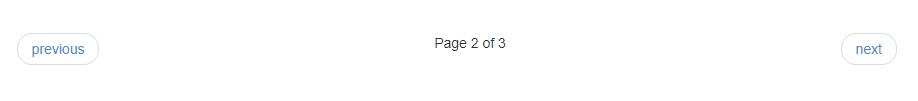
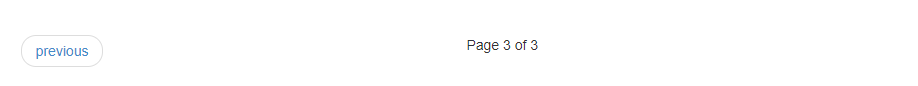
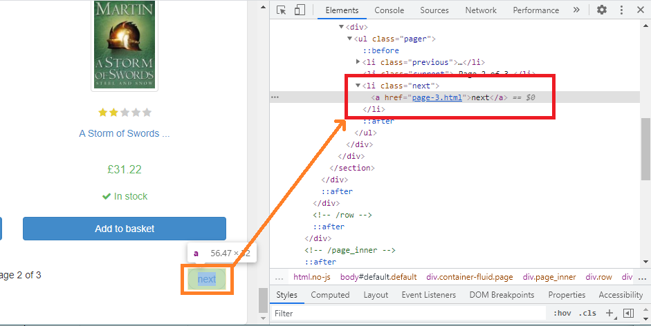
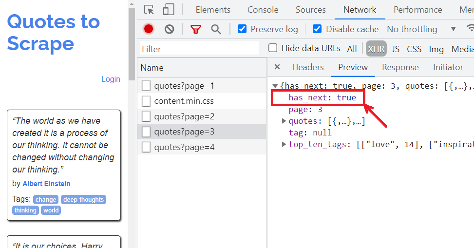
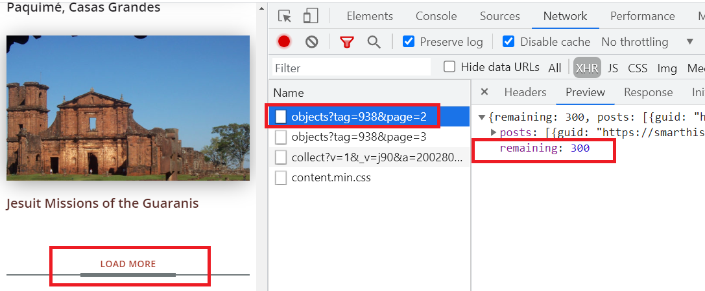

# Dealing With Pagination Via Python   

    

This article covers everything you need to know about dealing with pagination using Python. By the end of this article, you will be able to deal with various kinds of pagination in web scraping projects.

## Table of Contents

- [Introduction](#introduction)
- [Pagination With Next button](#pagination-with-next-button)
  - [Analyzing the Website](#analyzing-the-website)
  - [Python Code to Handle Pagination](#python-code-to-handle-pagination)
- [Pagination Without Next Button](#pagination-without-next-button)
- [Pagination With Infinite Scroll](#pagination-with-infinite-scroll)
  - [Handling Sites with JSON Response](#handling-sites-with-json-response)
  - [Handling Sites with HTML Response](#handling-sites-with-html-response)
- [Pagination With Load More Button](#pagination-with-load-more-button)

## Introduction

Pagination is a common feature for most websites. There is always a lot to display which can be done on one page. This is true for product listings, blogs, photos, videos, directories, etc. 

Each website has its way of using pagination. The common types of pagination are as follows:

- With Next Button
- Page Numbers without Next button
- Pagination with Infinite Scroll 
- Pagination with Load More

In this article, we will examine these cases and explore ways to handle these websites. 

## Pagination With Next button

Let's start with a simple example. Head over to [this page](http://books.toscrape.com/catalogue/category/books/fantasy_19/index.html) and see the pagination.

### Analyzing the Website



This site has a next button. If this button is clicked, the website will go to the next page. 



Now this site displays a previous button along with a next button. If we keep clicking next until it takes to the last page, this is how this looks:



Moreover, with every click, the URL is changing:

- Page 1 - `http://books.toscrape.com/catalogue/category/books/fantasy_19/index.html`
- Page 2 - `http://books.toscrape.com/catalogue/category/books/fantasy_19/page-2.html`
- Page 3 - `http://books.toscrape.com/catalogue/category/books/fantasy_19/page-3.html`

The next step is to press F12 and examine the HTML markup of the next button.



Now that we know that the website is not dynamic and that the next button is not a button, but an anchor element, we can find the URL of the next page by locating this anchor tag.

Let's write some Python code.

### Python Code to Handle Pagination

Let's start with basic code to get the first page using `requests` module. If you do not have it installed, install in a virtual environment. You may also want to install `BeautifuslSoup4`. We will be using `BeautifulSoup4` (or `bs4`) for locating the next button. We need a parser for `bs4`. In this article we are using `lxml`.

```shell
pip install requests beautifulsoup4 lxml
```

Let's start with writing a simple code that fetches the first page and prints the footer. Note that we are printing the footer so that we can keep track of the current page. In a real-world application, you will write the code here that scrapes data.

```python
import requests
from bs4 import BeautifulSoup

url = 'http://books.toscrape.com/catalogue/category/books/fantasy_19/index.html'

response = requests.get(url)
soup = BeautifulSoup(response.text, "lxml")
footer_element = soup.select_one('li.current')
print(footer_element.text.strip())
# Other code to extract data
```

The output of this code will be simply the footer of the first page:

```shell
Page 1 of 3
```

Few points to note here are as follows:

- Requests library is sending a GET request to the specified URL
- The `soup` object is being queried using CSS Selector. This CSS selector is website-specific.

Let's modify this code to locate the next button:

First we need to locate the next button. 

```python
next_page_element = soup.select_one('li.next > a')
```

If this next element is found, we can get the value of the `href`attribute. One important thing to note here is that often the `href` will be a relative url. In such cases, we can use `urljoin` method from `urllib.parse` module. This whole block of the code now needs to be wrapped in a `while True` loop.

```python
url = 'http://books.toscrape.com/catalogue/category/books/fantasy_19/index.html'
while True:
    response = requests.get(url)
    soup = BeautifulSoup(response.text, "lxml")
    footer_element = soup.select_one('li.current')
    print(footer_element.text.strip())
    # Pagination
    next_page_element = soup.select_one('li.next > a')
    if next_page_element:
        next_page_url = next_page_element.get('href')
        url = urljoin(url, next_page_url)
    else:
        break
```

The output of this code will be simply the footer of all three pages:

```shell
Page 1 of 3
Page 2 of 3
Page 3 of 3
```

You can find this code in the `next_button_requests.py` file in this repository.

## Pagination Without Next Button

Some websites will not show a next button, but just page numbers. For example, here is an example of the pagination from `https://www.gosc.pl/doc/791526.Zaloz-zbroje`.


For example, one such web page is `https://www.gosc.pl/doc/791526.Zaloz-zbroje`.  If we examine the HTML markup for this page, something interesting can be seen:

```html
<span class="pgr_nrs">
		<span>1</span>
		<a href="/doc/791526.Zaloz-zbroje/2">2</a>
		<a href="/doc/791526.Zaloz-zbroje/3">3</a>
		<a href="/doc/791526.Zaloz-zbroje/4">4</a>
</span>
```

This makes visiting all these pages easy. The first step is to retrieve the first page. Next, we can use BeautifulSoup to extract all these links to other pages. Finally, we can write a `for` loop that runs on all these links:

```python
url = 'https://www.gosc.pl/doc/791526.Zaloz-zbroje'
response = requests.get(url)
soup = BeautifulSoup(response.text, 'lxml')
page_link_el = soup.select('.pgr_nrs a')
# process first page
for link_el in page_link_el:
    link = urljoin(url, link_el.get('href'))
    response = requests.get(link)
    soup = BeautifulSoup(response.text, 'lxml')
    print(response.url)
    # process remaining pages
```

You can find the complete code in the file `no_next_button.py`.

## Pagination With Infinite Scroll

This kind of pagination does not show page numbers or a next button. 

Let's take [this site](https://techinstr.myshopify.com/collections/all) as an example. This site shows 8 products when on the page load. As you scroll down, it will dynamically load more items, 8 at a time. Another important thing to note here is that URL does not change as more pages are loaded. 

In such cases, websites use an asynchronous call to an API to get more content and show this content on the page using JavaScript. The actual data returned by the API can be HTML or JSON. 

### Handling Sites With JSON Response

Before you load the site, press `F12` to open Developer Tools, head over to Network tab, and select XHR.  Now go to `http://quotes.toscrape.com/scroll` and monitor the traffic. Scroll down to load more content. 

You will notices that as you scroll down,  more requests are sent to `quotes?page=x` , where x is the page number.




Remember that the most important step is **figuring out is when to stop**. This is where `has_next` in the response is going to be useful.

We can write a while loop as we did in the previous section. This time, there is no need of BeautifulSoup because the response is JSON. 

```python
url = 'http://quotes.toscrape.com/api/quotes?page={}'
page_numer = 1
while True:
    response = requests.get(url.format(page_numer))
    data = response.json()
    # Process data here
    # ...
    print(response.url)  # only for debug
    if data.get('has_next'):
        page_numer += 1
        else:
            break
```

Once we figure out how the site works, it's quite easy.

Now let's look at one more example.

### Handling Sites With HTML Response

In the previous section, we looked at that figuring out when to stop is important. The earlier example was easier. All we needed was to examine an attribute in the JSON. 

Some websites make it harder. Let's see one such example. 

Open developer tools by pressing F12 in your browser, go to Network tab, and then select XHR. Navigate to `https://techinstr.myshopify.com/collections/all`. You will notice that initially 8 products are loaded.

If we scroll down, the next 8 products are loaded. Also, notice the following:

- The number of products 132 is on the first page.
- The URL of the index page is different than the remaining pages.
- The response is HTML, with no clear way to identify when to stop.


To handle pagination for this site, first of we will load the index page and extract the number of products. We have already observed that 8 products are loaded in one request.  Now we can calculate the number of pages as follows:

Number of pages = 132/8 =16.5

Now we can use `math.ceil` function to get the last page, which will give us 17. Note that if you use round function, you may end up missing one page in some cases. Using `ceil` function ensures that pages are always rounded *up*.

One more change that we need to do is to use the session. The complete code is available in the `infinite_scroll_html.py` file. Here is the important part of the code:

```python
index_page = 'https://techinstr.myshopify.com/collections/all'
session = requests.session()

response = session.get(index_page)
soup = BeautifulSoup(response.text, "lxml")
count_element = soup.select_one('.filters-toolbar__product-count')
count_str = count_element.text.replace('products', '')
count = int(count_str)
# Process page 1 data here
page_count = math.ceil(count/8)
url = 'https://techinstr.myshopify.com/collections/all?page={}'
for page_numer in range(2, page_count+1): 
    response = session.get(url.format(page_numer))
    soup = BeautifulSoup(response.text, "lxml")
    # process page 2 onwards data here

```


## Pagination With Load More Button

The way the pagination using a Load More button works is very similar to how infinite scroll works. The only difference is how loading the next page is triggered on the browser.

As we are working directly with the web page without a browser, these two scenarios need to be handled the same way. 

Let's look at one example. Open `https://smarthistory.org/americas-before-1900/` with Developer Tools and click `Load More`.

You will see that the response is in JSON format with an attribute `remaining`. The key observations are as follows:

- Each request gets 12 results 
- The value of remaining decreases by 12 with every click of Load More
- If we set the value page to 1 in the API url, it get's the first page of the results - `https://smarthistory.org/wp-json/smthstapi/v1/objects?tag=938&page=1`



In this particular case, the user agent also needs to be set for this to work correctly. The complete code is in `load_more_json.py` file. Here is the important part of the code:

```python
url = 'https://smarthistory.org/wp-json/smthstapi/v1/objects?tag=938&page={}'
headers = {
    'user-agent': 'Mozilla/5.0 (Windows NT 10.0; Win64; x64) AppleWebKit/537.36 (KHTML, like Gecko) Chrome/91.0.4472.77 Safari/537.36',
}
page_numer = 1
while True:
    response = requests.get(url.format(page_numer), headers=headers)
    data = response.json()
    # Process data
    # ...
    print(response.url)  # only for debug
    if data.get('remaining') and int(data.get('remaining')) > 0:
        page_numer += 1
        else:
            break

```

