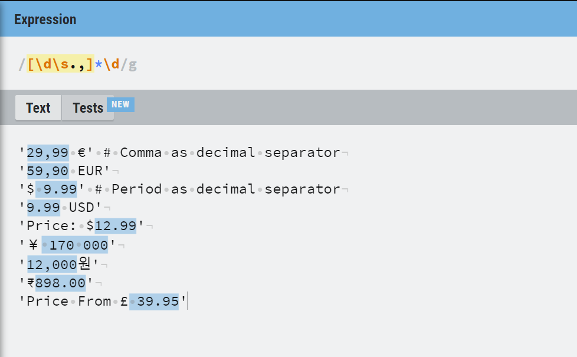

# Price Parsing Tutorial for Python 

    

This article covers everything you need to know about parsing prices in Python. By the end of this article, you will be able to extract price and currency from raw text, which is usually collected from external data sources like web pages or files.

## Table of Contents

- [Introduction](#introduction)
- [Parsing Prices With Python Standard Library](#parsing-prices-with-python-standard-library)
    - [Building Regular Expression](#building-regular-expression)
- [Price Parser Package](#price-parser-package)
    - [`Price` Class](#price-class)
    - [Parsing Price - Simple Cases](#parsing-price---simple-cases)
    - [Parsing Price - Complex Cases](#parsing-price---complex-cases)

## Introduction

This article covers a specific case - converting unprocessed text containing price and any other money-like data into price and currency. This is a common problem that needs to be addressed in cases of web scraping, data cleaning, and similar projects where the currency needs some cleaning.

The currency data can be in various formats, varying, especially with currency code in the locale. Here are few examples:

```python
'29,99 €' # Comma as decimal separator
'59,90 EUR'
'$ 9.99' # Period as decimal separator
'9.99 USD'
'Price: $12.99'
'￥ 170 000'
'12,000원'
'₹898.00'
'Price From £ 39.95'
```

As it is evident that every format needs a different way of extracting the currency and the price value.

This article will first examine how it can be done using Python Standard Library. In the second part, a specialized library for this purpose called Price Parser will be examined.

## Parsing Prices with Python Standard Library

The best way to extract numeric data from any string is to use regular expressions. Regular expression operations can be performed using Python's `re` module.

This is going to be a two-part process. The first part is building a regular expression, and the second part is using this expression.

### Building Regular Expression

Regular Expressions can be difficult for beginners. Websites like [Regexr](https://regexr.com/) can help build and test regular expressions.

Let's start with an example. 

- The digits can be matched with regex expression `\d`. 
- The price can also have a comma and a period.  These can be selected using `.` and `,`. 
- The price can also contain space. The whitespace characters can be selected using `\s`. 
- All above need to be put in a set using `[]`.
- There can be zero or more instances of the above. We need to use a wild card `*` for this.
- If we put together all these in a set, the resulting regular expression will be like this:

```python
expression = '[\d\s.,]*'
```

This expression will match the space outside the currency as well. This can be fixed easily by appending `\d` to ensure that even if space is matched, it ends with a number.

```python
expression = '[\d\s.,]*\d'
```

In this statement, all the characters from the set contained in the squared brackets will be matched, and an asterisk will ensure that 0 or more of these can be matched.

If you are building this regular expression at [Regexr](https://regexr.com/), you can paste in all the strings and see what is getting matched.



Now we can put together the Python code required to extract the price.

```python
import re

expression = '[\d\s.,]*\d'
price = '9.99 USD'

match = re.search(expression,price)

if match:
    print(match.group(0)) # Prints 9.99
```

This regular expression can extract prices from most of the cases. 

There are some problems, though. The first problems are the decimal separator and the thousand separators.  In some locales, a comma is used for decimal separators, and a period or space is used for thousand separators.

 For example, ten thousand euros and forty-five cents are written in these two possible ways.

```
10 000,45
10.000,45
```

On the other hand, other locales use a comma as the decimal separator and period as the thousand separators. In that case, the same price would be written like this:

```
10,000.45
```

To handle this, there will be a need to write more code.  

So far, we did not talk about getting the currency and cleaning up the price.

As we add more cases, the code will become more and more complex. 

This is where it is important to know that there is already a package published on the Python Package Index —[Price Parser](https://pypi.org/project/price-parser/).

## Price Parser Package

Price Parser is a package that aims to make parsing extracting price and currency from raw string much easier, without going into the complexities to handling all the cases. 

Even though Price Parser is written for parsing scraped price string, it works with files or any other data source that contain currency information in raw, unprocessed strings. 

Price Parser package can be installed easily from the terminal.

```shell
pip install date-parser
```

If you are using Anaconda, note that it is NOT available on any channel, and thus you will have to use `pip install` command there as well. 

```shell
conda install date-parser # DOES NOT WORK. Use pip install instead.
pip install date-parser # works
```

Before we explore how this package can be used, first, we must understand the class `Price` of this package.. 

### `Price` Class

Price Parser package uses a special class to represent the currency. This class is aptly named `Price`.  The `Price` class has two important attributes:

- `amount`:  Price value as `Decimal`
- `currency`: Currency as `string`

It also has a data descriptor `amount_float`, that will return the currency amount as `float`, instead of `Decimal()`.

With this in mind, let's see how we can parse price.

### Parsing Price - Simple Cases

Price Parser supports two ways of parsing. These are not different ways but rather just alias. They do the same thing.

These two functions are:

- `price_parser.parse_price`
- `Price.fromstring`

The signature of these functions is as follows:

```python
fromstring(price, currency_hint= None, decimal_separator= None) 
```

The only mandatory parameter is the price string. The other two parameters are optional. This function will return an instance of `Price`.

Here is the first example. In this example, it can be seen how the `amount`, `amount_float`, and `currency` can be used.

```python
>>> from price_parser import Price
>>> price = Price.fromstring('29,99 €')
>>> print(price)
Price(amount=Decimal('29.99'), currency='€')
>>> price.amount
Decimal('29.99')
>>> price.amount_float
29.99
>>> price.currency
'€'

```
For simple cases, supplying only the price string is enough for the method to work. Here are few more examples:

```python
>>> Price.fromstring('59,90 EUR')
Price(amount=Decimal('59.90'), currency='EUR')
>>> Price.fromstring('12,000원')
Price(amount=Decimal('12000'), currency='원')

```

### Parsing Price - Complex Cases

The `fromstring` function can handle uncleaned strings and extract price amount and currency for most of the cases.

```python
>>> Price.fromstring('Price From £ 39.95')
Price(amount=Decimal('39.95'), currency='£')
```

Often, € sign is used as the decimal separator. This is handled by Price Parser without any additional tweaking.

```python
>>> Price.fromstring('29€ 99 ')
Price(amount=Decimal('29.99'), currency='€')
```

The previously discussed difficult cases, where space or a period can be used as thousands of separators are supported out of the box.

```python
>>> Price.fromstring('10.000,45€')
Price(amount=Decimal('10000.45'), currency='€')
>>> Price.fromstring('10 000,45€')
Price(amount=Decimal('10000.45'), currency='€')
```

Both `0` and `free` are interpreted as `0`. Further, if amount or currency cannot be determined by Price Parser, it will return a `Price` object with `amount` and/or `currency` will be set to `None`.

```python
>>> Price.fromstring('free')
Price(amount=Decimal('0'), currency=None)
>>> Price.fromstring('$')
Price(amount=None, currency='$')
>>> Price.fromstring('0')
Price(amount=Decimal('0'), currency=None)
>>> Price.fromstring('not available')
Price(amount=None, currency=None)
```

Currency hint can be used if Price Parser is not able to detect the currency. For example, United Arab Emirates Dirham is written as both AED and Dhs. Price Parser can handle AED, but can not handle Dhs. In this case, `currency_hint` is useful.

```python
>>> Price.fromstring('29 AED')
Price(amount=Decimal('29'), currency='AED') # correct currency
>>> Price.fromstring('29 Dhs')
Price(amount=Decimal('29'), currency=None) # currency is None
>>> Price.fromstring('29 Dhs', currency_hint="AED") # send currency_hint
Price(amount=Decimal('29'), currency='AED') # currency is correct
```

Finally, if the decimal separator is known, it can be set using the `decimal_separator` argument. This will ensure that there are no errors in guessing the decimal separator. Here is an example:

```python
>>> Price.fromstring("Price: $140,600") # It's actually 140.600
Price(amount=Decimal('140600'), currency='$') # Wrong output
>>> Price.fromstring("Price: $140,600", decimal_separator=",")
Price(amount=Decimal('140.600'), currency='$') # Correct output
```

