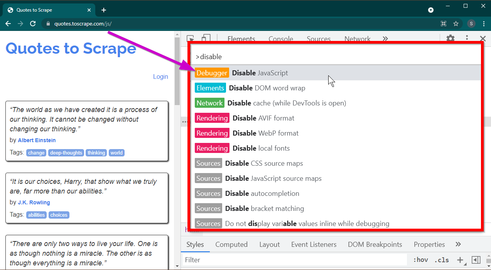
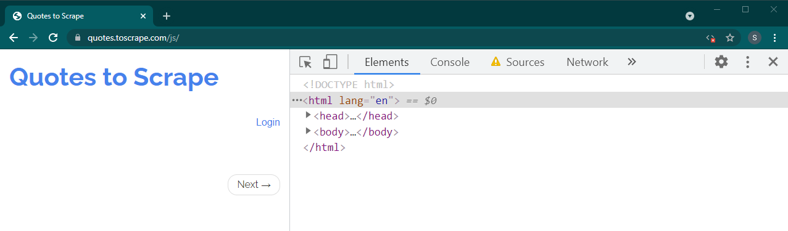
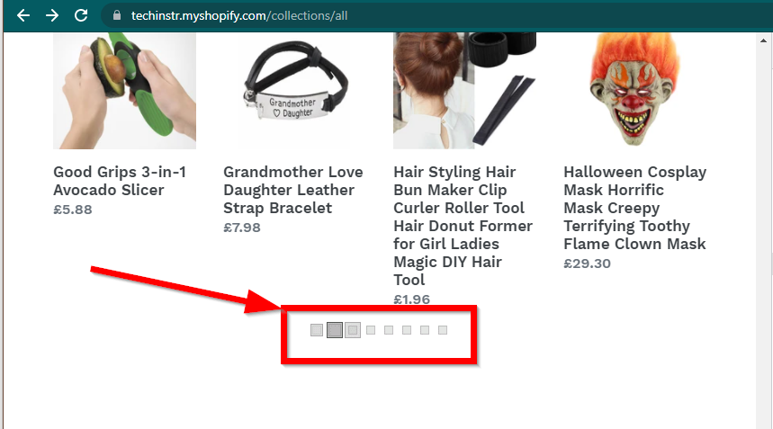
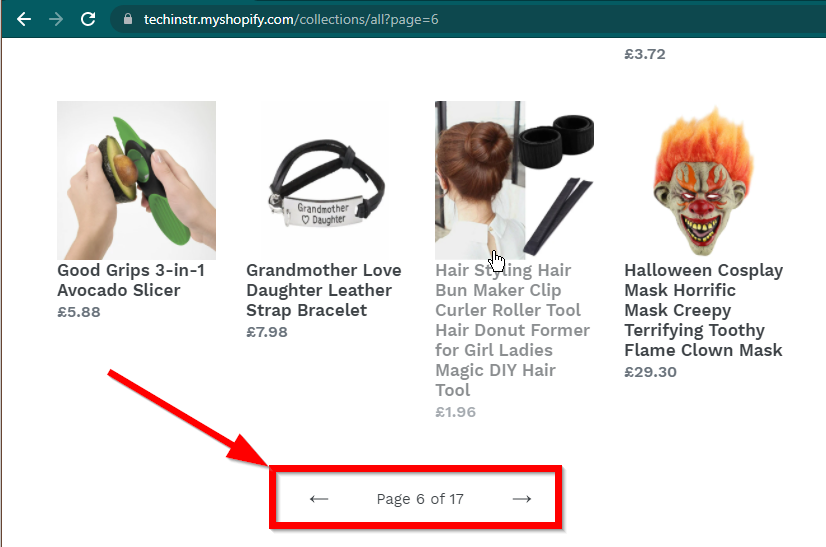
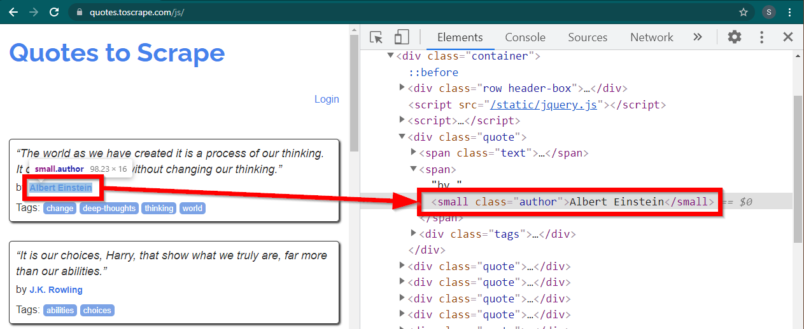
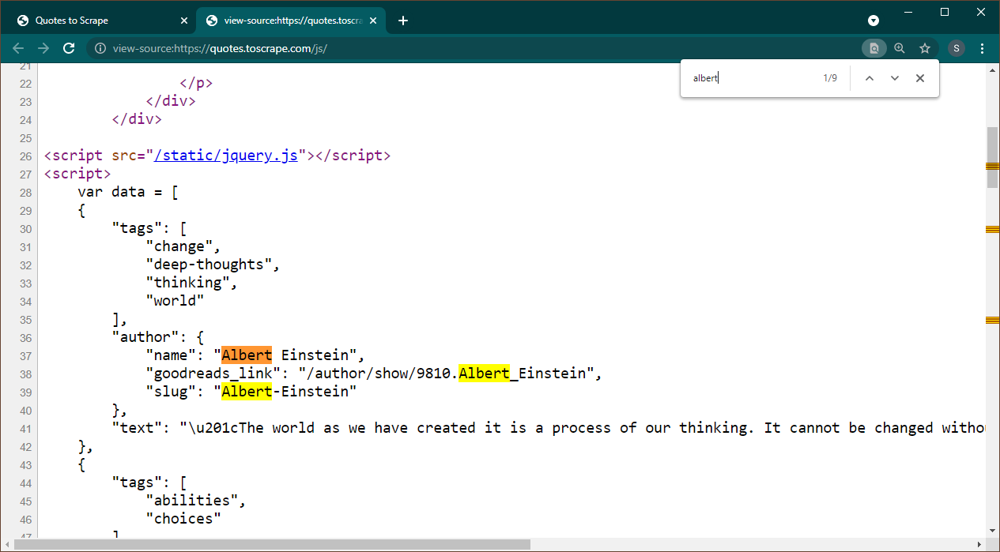
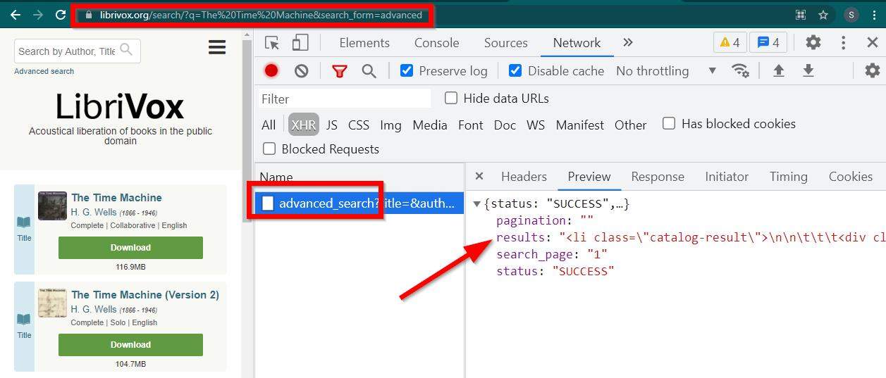

# Scraping Dynamic JavaScript / Ajax Websites With BeautifulSoup: A Complete Tutorial

[](https://github.com/topics/python) [](https://github.com/topics/javascript)

## Table of contents

- [Revisiting BeautifulSoup and Requests](#revisiting-beautifulsoup-and-requests)
- [Is This Website Dynamic or Static?](#is-this-website-dynamic-or-static)
- [Can BeautifulSoup Render `JavaScript`?](#can-beautifulsoup-render-javascript)
- [Scraping Dynamic Web Pages With Selenium](#scraping-dynamic-web-pages-with-selenium)
  - [Finding Elements Using Selenium](#finding-elements-using-selenium)
  - [Finding Elements Using BeautifulSoup](#finding-elements-using-beautifulsoup)
  - [Headless `Browser`](#headless-browser)
- [Web Scraping Dynamic Sites by Locating AJAX Calls](#web-scraping-dynamic-sites-by-locating-ajax-calls)
  - [Data Embedded In the Same Page](#data-embedded-in-the-same-page)
  - [Data In Other Pages](#data-in-other-pages)

Web scraping most of the websites may be comparatively easy. This topic is already covered at length in [this tutorial](https://github.com/oxylabs/Python-Web-Scraping-Tutorial). There are many sites, however, which can not be scraped using the same method. The reason is that these sites load the content dynamically using JavaScript.

This technique is also known as AJAX (Asynchronous JavaScript and XML). Historically, this standard was included creating an `XMLHttpRequest` object to retrieve XML from a web server without reloading the whole page. These days, this object is rarely used directly. Usually, a wrapper like jQuery is used to retrieve content such as JSON, partial HTML, or even images.

## Revisiting BeautifulSoup and Requests

To scrape a regular web page, at least two libraries are required. The `requests` library downloads the page. Once this page is available as an HTML string, the next step is parsing this as a BeautifulSoup object. This BeautifulSoup object can then be used to find specific data.

Here is a simple example script that prints the text inside the `h1` element with `id` set to `firstHeading`.

```python
import requests                                            
from bs4 import BeautifulSoup                              

response = requests.get("https://quotes.toscrape.com/")
bs = BeautifulSoup(response.text,"lxml")
author = bs.find("small",class_="author")
if author:
    print(author.text)

## OUTPUT
# Albert Einstein
```

Note that we are working with version 4 of the Beautiful Soup library. Earlier versions are discontinued. You may see beautiful soup 4 being written as just Beautiful Soup, BeautifulSoup, or even bs4. They all refer to the same beautiful soup 4 library.

The same code will not work if the site is dynamic. For example, the same site has a dynamic version at `https://quotes.toscrape.com/js/`  (note *js* at the end of this URL).

```python
response = requests.get("https://quotes.toscrape.com/js") # dynamic web page
bs = BeautifulSoup(response.text,"lxml")
author = bs.find("small",class_="author")
if author:
    print(author.text)

## No output
```

The reason is that the second site is dynamic where the data is being generated using `JavaScript`.

There are two ways to handle sites like this.

- Using a tool like Selenium or Puppeteer to open a real browser to render the dynamic web page
- Identify the AJAX links that contain the data, and work with those directly.

These two approaches are covered at length in this tutorial.

However, first, we need to understand how to determine if a site is dynamic.

## Is This Website Dynamic or Static?

Here is the easiest way to determine if a website is dynamic using Chrome or Edge. (Both of these browsers use Chromium under the hood).

Open Developer Tools by pressing the `F12` key. Ensure that the focus is on Developer tools and press the `CTRL+SHIFT+P` key combination to open Command Menu.



It will show a lot of commands. Start typing `disable` and the commands will be filtered to show  `Disable JavaScript`. Select this option to disable `JavaScript`.

Now reload this page by pressing `Ctrl+R` or `F5`. The page will reload.

If this is a dynamic site, a lot of the content will disappear:



In some cases, the sites will still show the data but will fall back to basic functionality. For example, this site has an infinite scroll. If JavaScript is disabled, it shows regular pagination.

|  |  |
| ---------------------------------------------- | ------------------------------------------------------- |
| JavaScript Enabled                             | JavaScript Disabled                                     |

The next question that needs to be answered is the capabilities of BeautifulSoup.

## Can BeautifulSoup Render `JavaScript`?

The short answer is no.

It is important to understand the words like parsing and rendering. Parsing is simply converting a string representation of a Python object into an actual object.

So what is Rendering? Rendering is essentially interpreting HTML, JavaScript, CSS, and images into something that we see in the browser.

Beautiful Soup is a Python library for pulling data out of HTML files. This involves parsing HTML string into the the BeautifulSoup object. For parsing, first, we need the HTML as string, to begin with.  Dynamic websites do not have the data in the HTML directly. It means that BeautifulSoup cannot work with dynamic websites.

Selenium library can automate loading and rendering websites in a browser like Chrome or Firefox. Even though Selenium supports pulling data out of HTML, it is possible to extract complete HTML and use Beautiful Soup instead to extract the data.

Let's begin dynamic web scraping with Python using Selenium first.

## Scraping Dynamic Web Pages With Selenium

Installing Selenium involves installing three things:

1. The browser of your choice (which you already have):
   - Chrome, Firefox, Edge, Internet Explorer, Safari, and Opera browsers are supported. In this tutorial, we will be using Chrome.

2. The driver for your browser:

   - Driver for Chrome can be download from [this page](https://chromedriver.chromium.org/downloads). Download the zip file containing the driver and unzip it. Take a note of this path.
   - Visit [this link](https://www.selenium.dev/documentation/en/webdriver/driver_requirements/#quick-reference) for information about drivers for other browsers.

3. Python Selenium Package:
   - This package can be installed using the pip command:

   ```shell
   pip install selenium
   ```

   - If you are using Anaconda, this can be installed from the `conda-forge` channel.

   ```shell
   conda install -c conda-forge selenium 
   ```

The basic skeleton of the Python script to launch a browser, load the page, and then close the browser is simple:

```python
from selenium.webdriver import Chrome

driver = Chrome(executable_path='c:/driver/chromedriver.exe')
driver.get('https://quotes.toscrape.com/js/')
#
# Code to read data from HTML here
#
driver.quit()
```

The `executable_path` is the complete path of the driver. On Windows, backslashes need to be changed to forward slashes.

Now that we can load the page in the browser, let's look into extracting specific elements. There are two ways to extract elements—Selenium and Beautiful Soup.

### Finding Elements Using Selenium

Our objective in this example is to find the author element.

Load the site`https://quotes.toscrape.com/js/` in Chrome, right-click the author name, and click Inspect. This should load Developer Tools with the author element highlighted as follows:



This is a `small` element with its `class` attribute set to `author`.

```html
<small class="author">Albert Einstein</small>
```

Selenium allows various methods to locate the HTML elements. These methods are part of the driver object. Some of the methods that can be useful here are as follows:

```python
element = driver.find_element_by_class_name("author")
element = driver.find_element_by_tag_name("small")
```

There are few other methods, may be useful for other scenario. These methods are as follows:

```python
element = driver.find_element_by_id("abc")
element = driver.find_element_by_link_text("abc")
element = driver.find_element_by_xpath("//abc")
element = driver.find_element_by_css_selector(".abc")

```

Perhaps the most useful methods are `find_element_by_css_selector` and `find_element_by_xpath`. Any of these two methods should be able to select most of the scenarios.

Let's modify the code so that the first author can be printed.

```python
from selenium.webdriver import Chrome
driver = Chrome(executable_path='c:/driver/chromedriver.exe')
driver.get('https://quotes.toscrape.com/js/')

element = driver.find_element_by_class_name("author")

print(element.text)
driver.quit()
```

What if you want to print all the authors?

All the `find_element` methods have a counterpart - `find_elements` . Note the pluralization. To find all the authors, simply change one line:

```python
elements = driver.find_elements_by_class_name("author")
```

This returns a list of elements. We can simply run a loop to print all the authors:

```python
for element in elements:
    print(element.text)
```

*Note: The complete code is in [selenium_example.py](https://github.com/oxylabs/Scraping-Dynamic-JavaScript-Ajax-Websites-With-BeautifulSoup/blob/main/selenium_example.py) code file.*

However, if you are already comfortable with BeautifulSoup, you can create the Beautiful Soup object.

### Finding Elements Using BeautifulSoup

As we saw in the first example, the Beautiful Soup object needs HTML. For web scraping static sites, the HTML can be retrieved using `requests` library. The next step is parsing this HTML string into the BeautifulSoup object.

```python
response = requests.get("https://quotes.toscrape.com/")
bs = BeautifulSoup(response.text,"lxml")
```

Let 's find out how to scrape a dynamic website with BeautifulSoup.

The following part remains unchanged from the previous example.

```python
from selenium.webdriver import Chrome
driver = Chrome(executable_path='c:/driver/chromedriver.exe')
driver.get('https://quotes.toscrape.com/js/')
```

The rendered HTML of the page is available in the attribute `page_source`.

```python
soup = BeautifulSoup(driver.page_source, "lxml")
```

Once the soup object is available, all Beautiful Soup methods can be used as usual.

```python
author_element = soup.find("small", class_="author")
print(author_element.text)
```

*Note: The complete source code is in [selenium_bs4.py](https://github.com/oxylabs/Scraping-Dynamic-JavaScript-Ajax-Websites-With-BeautifulSoup/blob/main/selenium_bs4.py)*

### Headless `Browser`

Once the script is ready, there is no need for the browser to be visible when the script is running. The browser can be hidden, and the script will still run fine. This behavior of a browser is also known as a headless browser.

To make the browser headless, import `ChromeOptions`. For other browsers, their own Options classes are available.

```python
from selenium.webdriver import ChromeOptions
```

Now, create an object of this class, and set the `headless` attribute to True.

```python
options = ChromeOptions()
options.headless = True
```

Finally, send this object while creating the Chrome instance.

```python
driver = Chrome(executable_path='c:/driver/chromedriver.exe', options=options)
```

Now when you run the script, the browser will not be visible. See [selenium_bs4_headless.py](https://github.com/oxylabs/Scraping-Dynamic-JavaScript-Ajax-Websites-With-BeautifulSoup/blob/main/selenium_bs4_headless.py) file for the complete implementation.

## Web Scraping Dynamic Sites by Locating AJAX Calls

Loading the browser is expensive—it takes up CPU, RAM, and bandwidth which are not really needed. When a website is being scraped, it's the data that is important. All those CSS, images, and rendering are not really needed.

The fastest and most efficient way of scraping dynamic web pages with Python is to locate the actual place where the data is located.

There are two places where this data can be located:

- The main page itself, in JSON format, embedded in a `<script>` tag
- Other files which are loaded asynchronously. The data can be in JSON format or as partial HTML.

Let's look at few examples.

### Data Embedded In the Same Page

Open <https://quotes.toscrape.com/js> in Chrome. Once the page is loaded, press <u>Ctrl+U</u> to view source. Press Ctrl+F to bring up the search box, search for Albert.



We can immediately see that data is embedded as a JSON object on the page. Also, note that this is part of a script where this data is being assigned to a variable `data`.

In this case, we can use the Requests library to get the page and use Beautiful Soup to parse the page and get the script element.

```python
response = requests.get('https://quotes.toscrape.com/js/')
soup = BeautifulSoup(response.text, "lxml")
```

Note that there are multiple `<script>` elements. The one which contains the data that we need does not have `src` attribute. Let's use this to extract the script element.

```python
script_tag = soup.find("script", src=None)
```

Remember that this script contains other JavaScript code apart from the data that we are interested in. For this reason, we are going to use a regular expression to extract this data.

```python
import re
pattern = "var data =(.+?);\n"
raw_data = re.findall(pattern, script_tag.string, re.S)
```

The data variable is a list containing one item. Now we can use the JSON library to convert this string data into a python object.

```python
if raw_data:
    data = json.loads(raw_data[0])
print(data)
```

The output will be the python object:

```python
[{'tags': ['change', 'deep-thoughts', 'thinking', 'world'], 'author': {'name': 'Albert Einstein', 'goodreads_link': '/author/show/9810.Albert_Einstein', 'slug': 'Albert-Einstein'}, 'text': '“The world as we have created it is a process of our thinking. It cannot be changed without changing our thinking.”'}, {'tags': ['abilities', 'choices'], 'author': {'name': 'J.K. Rowling', .....................
```

This list can not be converted to any format as required. Also, note that each item contains a link to the author page. It means that you can read these links and create a spider to get data from all these pages.

This complete code is included in [data_in_same_page.py](https://github.com/oxylabs/Scraping-Dynamic-JavaScript-Ajax-Websites-With-BeautifulSoup/blob/main/data_in_same_page.py).

### Data In Other Pages

Web scraping dynamic sites can follow a completely different path. Sometimes the data is loaded on a separate page altogether. One such example is [Librivox](https://librivox.org/search/?q=The%20Time%20Machine&search_form=advanced).

Open Developer Tools, go to Network Tab and filter by XHR. Now open this link or search for any book. You will see that the data is an HTML embedded in JSON.



Note few things:

- The URL displayed by the browser is  `https://librivox.org/search/?q=...`

- The data is in `https://librivox.org/advanced_search?....`

- If you look at headers, you will find that the advanced_search page is sent a special header `X-Requested-With: XMLHttpRequest`

Here is snippet to extract this data:

```python
headers = {
    'X-Requested-With': 'XMLHttpRequest'
}
url = 'https://librivox.org/advanced_search?title=&author=&reader=&keywords=&genre_id=0&status=all&project_type=either&recorded_language=&sort_order=alpha&search_page=1&search_form=advanced&q=The%20Time%20Machine'
response = requests.get(url, headers=headers)
data = response.json()
soup = BeautifulSoup(data['results'], 'lxml')
book_titles = soup.select('h3 > a')
for item in book_titles:
    print(item.text)
```

The complete code is included in [librivox.py](code/librivox.py) file.
